# P2: Olist — the DP-600 build

*25 day-sessions mapped to the exam's skills outline; every step closed on a measured number, not "it succeeded."*

**Why it exists.** This is my DP-600 (Fabric Analytics Engineer) preparation, built rather than read. Each session covered a slice of the [skills outline](https://learn.microsoft.com/en-us/credentials/certifications/resources/study-guides/dp-600) (revised 21 Jul 2026) and ended in a done-check: a row count, a timing, a file count or a screenshot recorded against an expected value. The exam was the reason. The findings below are what it produced, and several of them corrected the build guide I was working from.

**Scope.** Two parts of one build, run Sep 16–24, 2026:

- **Part 1: Domain 1 on existing workspaces.** Days 1–7 ran on the [P1](../P1-nyc-taxi/) and [Job Search](../job-search-fabric/) workspaces plus a sandbox: ten security layers built and tested as real users, Git integration, deployment pipelines, impact analysis, file formats, XMLA and the external tools.
- **Parts 2–4: the Olist build.** Days 8–25 built a new workspace on the [Brazilian E-Commerce dataset by Olist](https://www.kaggle.com/datasets/olistbr/brazilian-ecommerce): medallion lakehouse, incremental pipeline, SCD Type 2, a Direct Lake semantic model with calculation groups, RLS/OLS and DAX depth, then real-time and Direct Lake internals.

**Environment:** Fabric trial capacity (FTL4). Workspace `P2 Olist`, Git-connected to [`CarlWooldridge/fabric-p2-olist`](https://github.com/CarlWooldridge/fabric-p2-olist) from its first minute (62 real-dated commits, item definitions only), with a Dev → Test deployment pipeline. The trial capacity has since ended; this folder and that repo are the record.

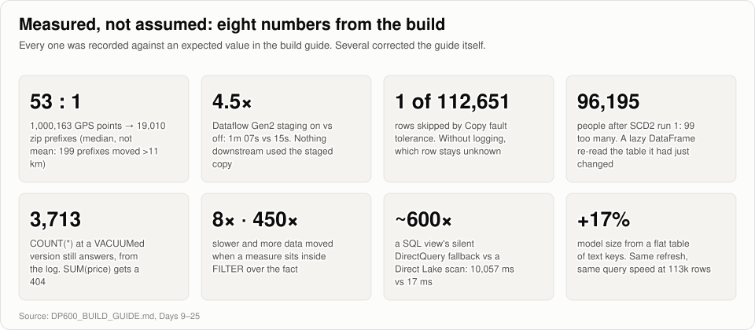

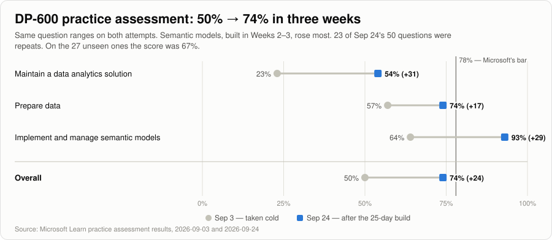

---

## Selected findings

**Security and lifecycle (Part 1)**

- **Security is enforced where the query runs, and as whom.** The same Viewer opened the same warehouse table through five paths: Import and Direct Lake on OneLake returned every row with real values; DirectQuery and Direct Lake on the SQL endpoint returned only the user's rows, masked. [→](#11-security-is-enforced-where-the-query-runs)
- **A delegated-identity shortcut leaks everything.** A test user holding only Read and ReadData on a warehouse read all 5 rows of its RLS-and-masked table through a delegated shortcut, unfiltered and unmasked, from Spark and SQL alike. The passthrough shortcut refused until ReadAll was granted, then returned all 5 too. Warehouse security never travels through any shortcut.
- **An external partner, built for real:** a Viewer role showed the guest the whole workspace, an app showed one report, and the visuals still failed until the model moved to a fixed-identity connection, which then applies to *every* viewer. Row rules have to move into the model.
- **What Git carries:** the warehouse travels as a full SQL project, RLS policy and masks included, but **no `GRANT`/`DENY`**; model roles travel, **members never do**; a lakehouse travels as metadata only.
- **A Direct Lake model doesn't rebind across deployment stages,** and both deployment-rule types are grayed out for it. The fix is to parameterize the OneLake path through Git, then set a parameter rule.
- **A column rename broke a model with an error that said "capacity or license issue."** The DirectQuery model had cached a stale column list that refresh wouldn't clear; `queryinsights` showed the SQL it actually sent; **Git repaired it** (a no-op M edit, then Update all).

**Data engineering (Part 2)**

- **Query folding, corrected:** a whole-column expression *did* fold, collapsed by the engine to the constant `'bebes'`. Only `Table.Buffer` broke folding. Folding preserves M's semantics (null handling), not the shape of the steps.
- **Geolocation: 1,000,163 points → 19,010 zip prefixes (53:1).** Filter first, then take the median: 42 points sat outside Brazil, 226 prefixes spread over more than 1°, and 199 moved more than 11 km between mean and median.
- **Header → lines, with no `dim_order` and no geo dimension.** Two filter paths to "state" would have made every state slicer ambiguous. 99,441 orders, 112,650 lines.
- **SCD2 on real address changes:** 252 people, 259 changes, 40 of them across states; 44,034 + 52,062 + 99 + 68 = **96,263 versions**.
- **The lazy-evaluation bug:** the first SCD2 run produced 96,195 people, 99 too many, because a DataFrame re-read the table the `MERGE` had just changed. Every row count matched; only the durable key was wrong. `.localCheckpoint()` fixed it.
- **OPTIMIZE, Z-Order, VACUUM on a deliberately fragmented copy:** 240 → 19 → 10 files; the busiest seller's data went 240 → 19 → **2** files. VACUUM changed nothing a query sees.
- **After VACUUM, `COUNT(*)` at version 0 still answered (3,713) and `SUM(price)` got a 404.** The count comes from the Delta log. A version you can list is not a version you can read.

**The semantic model (Part 3)**

- **"The rule applied" and "the model moved" are two facts.** The deployment rule applied correctly, and Test still showed Dev's numbers: a workspace commit had written the literal URL back over the parameter. On the second deploy, Test failed against its own empty lakehouse, which was the pass.
- **Web *Edit tables* fails while the source path is a parameter.** Add tables first, parameterize last. It also lists only the tables the SQL endpoint has synced.
- **2018 YoY of +20.0% is misleading; like-for-like it's +137.3%.** The data ends 2018-09-03, and the calendar comparison doesn't know that.
- **Field parameters *do* work on Direct Lake on OneLake.** Alex (the AI assistant) declared them unsupported after a blank visual; I found two UI mistakes (wells reversed, **Show selected field** off). The diagnosis lesson stays on the record.
- **The promised "bad filter" gap didn't exist:** the optimizer rewrote `FILTER(fact, RELATED(col) = x)` into the column filter. The corrected rule: a *measure* inside `FILTER` is **~8× slower and moves ~450× more data**; a measure inside `SUMX` is **~9× slower**.
- **A static seller role leaks:** only Revenue changed; orders, customers and payments showed everyone's. A customer-state rule secures all four. RLS belongs on the table at the top of what you protect.
- **Model RLS protects the report; OneLake security protects the data.** `test.north` saw only SP orders in the report and every customer in the lakehouse.
- **Storage mode is a partition property:** two Import models were built entirely through Git and TMDL, with no Desktop ([`80325de`](https://github.com/CarlWooldridge/fabric-p2-olist/commit/80325de), [`058da34`](https://github.com/CarlWooldridge/fabric-p2-olist/commit/058da34)).
- **Good vs bad model: 73.15 vs 85.56 MiB (+17%) at the same query speed.** Text keys cost 11.3 MB each against ~3.5 MB for integers; review comments cost 7.5 MB; timestamps kept seconds.

**Direct Lake and capacity (Part 4)**

- **A SQL view silently cost ~600×:** 17 ms as a Direct Lake scan vs 10,057 ms through DirectQuery fallback, 9,329 ms of it opening the connection. `DirectLakeOnly` turns the silent fallback into an error.
- **HTTP 430, explained:** the trial's 8 Spark vCores fit exactly one Medium-node session. A Small-node custom pool fits two, but isn't pre-warmed.

---

## The architecture

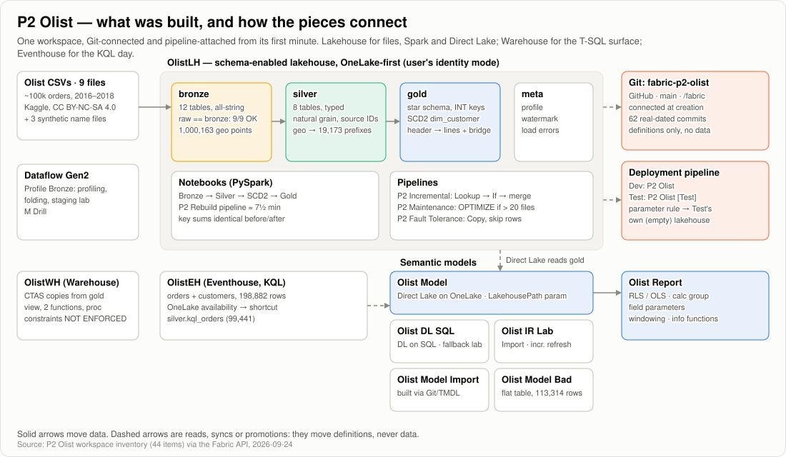

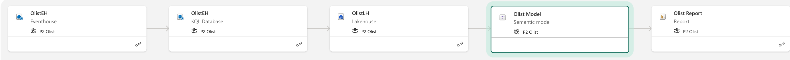

One workspace, Git-connected and pipeline-attached at creation, so every item was versioned as it was built. The lakehouse is schema-enabled and OneLake-first (user's identity mode): `bronze` (all-string, as landed), `silver` (typed, natural grain), `gold` (star schema, integer keys) and a `meta` schema for plumbing (profile, watermark, load errors) that isn't a fourth medallion layer. A Warehouse sits alongside for the T-SQL surface; an Eventhouse for the KQL day.

---

## Part 1: Domain 1 on existing workspaces (Days 1–7)

Run on the P1 NYC Taxi and Job Search workspaces with three real test users and one B2B guest, because a security layer you test as the workspace admin is a layer you haven't tested.

### 1.1 Security is enforced where the query runs

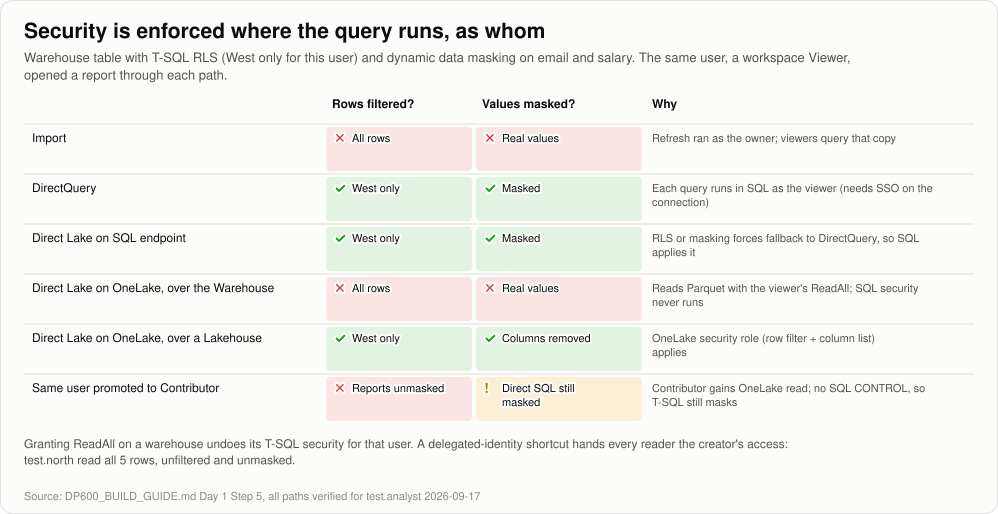

- **Granting ReadAll on a warehouse undoes its T-SQL security** for that user: Spark and Direct Lake on OneLake read the files, and SQL security never runs.
- **Permission changes took up to two hours to reach SQL.** Hours went to chasing lag. The method that came out of it: wait, re-test, then theorize.
- **Viewer boundaries, measured:** a Viewer opens the lakehouse and sees no tables; a Direct Lake on OneLake report fails for them; **Build** permission is the answer to "build a report, don't touch the model."
- **Model RLS is default-deny.** Once a model has any role, a Viewer in none is refused.
- Details worth keeping: CLS makes `SELECT *` error while an explicit column list works; masking isn't access control (`WHERE salary BETWEEN 90000 AND 92000` finds the row it displays as 0); warehouse collation is case-sensitive, so a UPN that differs in case silently fails RLS; a mapping-table RLS fails closed; removing a sensitivity label upstream doesn't remove it downstream.

All ten layers, what each decides and where it's enforced: **[Security in Fabric: ten layers](https://carlwooldridge.github.io/fabric-portfolio/P2-olist/reference/security-ten-layers.html)** ([source](reference/security-ten-layers.html)).

### 1.2 What travels, and who doesn't

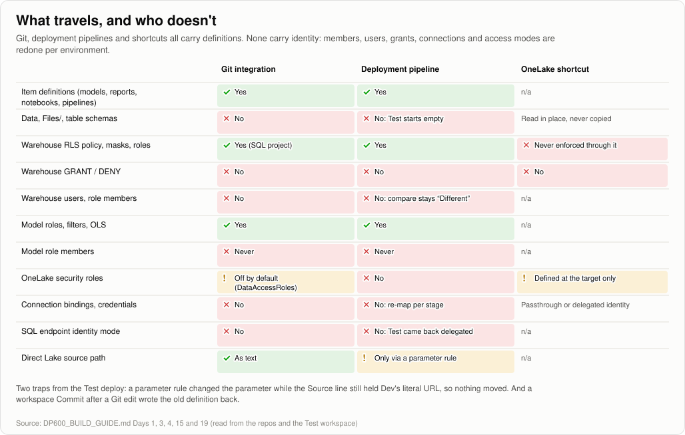

- **Deployment moves code, never data.** The warehouse compare stays "Different" forever, because users and role members don't deploy ([compare](screenshots/d04-deploy-compare-warehouse-different.png), [change review](screenshots/d04-deploy-change-review-members-missing.png)).
- **Deployment rules are grayed out for a Direct Lake model** ([screenshot](screenshots/d04-deployment-rules-grayed.png)).
- **Git conflict resolution commits over; there's no line merge.** Rollback is a Git operation, then *Update all*.
- **Impact analysis per item type** (lakehouse 23 items / 2 workspaces, warehouse 25 / 3, dataflow 27 including hidden staging items, model 1): it caught Test models that hadn't rebound, and was partly wrong about which ones ([lakehouse](screenshots/d05-impact-lakehouse.png), [warehouse](screenshots/d05-impact-warehouse.png), [dataflow](screenshots/d05-impact-dataflow.png), [model](screenshots/d05-impact-model.png)).
- **The rename break,** in three screenshots: [the error that blames capacity](screenshots/d05-rename-error-says-capacity.png), [the stale column the model kept](screenshots/d05-stale-column-name-in-model.png), [the SQL it actually sent](screenshots/d05-queryinsights-model-sql.png).

### 1.3 Formats, XMLA and the external tools

- **File formats, measured:** `.pbix` 1,938 KB · `.pbit` 17 KB · `.pbip` 1 KB · `.pbids` 1 KB. A `.pbix` holds data only for Import tables ([screenshot](screenshots/d06-file-formats-sizes.png)).
- **XMLA Read Write is a capacity setting, and TMSL can't replace one measure**, only the whole table. Semantic Link's `execute_tmsl` works from a notebook. An XMLA edit shows up as *Uncommitted* in source control, which is not the same as not applied ([screenshot](screenshots/d06-xmla-edit-uncommitted.png)).
- **Storage tools read 0 for Direct Lake on OneLake:** VertiPaq Analyzer, the Memory analyzer and the storage DMVs all agree ([VertiPaq](screenshots/d07-vertipaq-not-resident.png), [Memory analyzer](screenshots/d07-memory-analyzer-zeros.png)).
- **`dim_date[Date]` was 74% of the warehouse model** (1.70 of 2.17 MiB) because out-of-range trip dates stretched it from 2008 to 2081 ([VertiPaq](screenshots/d07-vertipaq-dim-date-74pct.png), [the axis](screenshots/d07-dates-2008-to-2081.png)).
- **ALM Toolkit pre-selects *Update* on the rule-managed parameter,** which would silently repoint Test at Dev ([screenshot](screenshots/d07-alm-toolkit-update-trap.png)).
- Best Practice Analyzer: 181 objects breaking 16 rules, four of them real. DAX Studio: 1,203 ms cold vs 127 ms warm, 88% storage engine, so the fix is the model, not the DAX.

---

## Part 2: The Olist build, Domain 2 (Days 8–14)

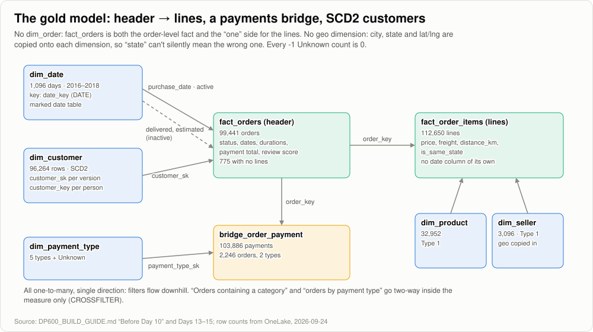

### Land and profile

- **Ground truth from Python's CSV reader, not `wc -l`**: reviews contain quoted newlines. Raw vs bronze: **9/9 tables match** ([screenshot](screenshots/d08-raw-ground-truth-counts.png)). Bronze stays all-string on purpose, so zip prefixes like `01001` survive and a bad cast is a silver bug you can re-run.
- **Dataflow Gen2 staging on: 1m 07s; off: 15s (4.5×)** for the same ten queries. Nothing downstream used the staged copy ([screenshot](screenshots/d09-staging-on-vs-off.png)).
- **The folding ladder** ([screenshot](screenshots/d09-folding-constant.png)): the Dataflow was a profiling and folding lab, not the ingestion path. `Lakehouse.Contents` can never show a data-source query, so "can't fold" and "broke folding" look identical there.

### Silver fixes the data; gold shapes it

- **`customer_id` is per order:** 99,441 rows are 96,096 people, 3,345 of them repeat buyers.
- An inner join to the category translation table would have silently dropped 623 products (610 null categories, 13 untranslated).
- Seller cities held `/`, commas, emails and zip codes. One backslash row slipped the check and **was caught by the Copy activity the next day**.
- **Surrogate keys** are issued once and never move; each dimension is its own key memory, with `-1` Unknown rows. The biggest win is replacing `order_id`'s 98,666 hex strings.

### Incremental load and pipeline control flow

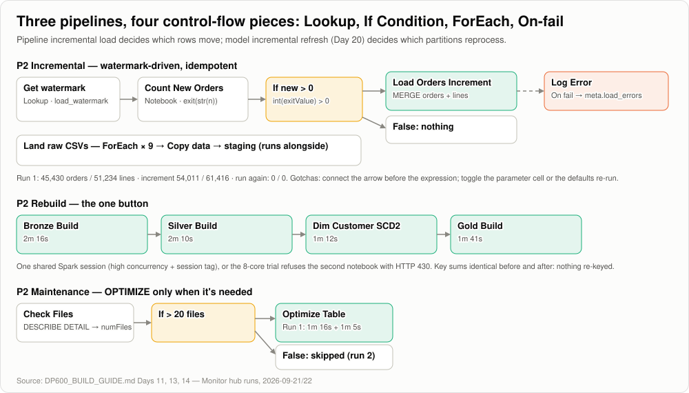

- **Watermark load: 45,430 orders, then +54,011; a second run loaded 0 and 0.** Lines follow their orders.
- **Pipeline gotchas:** connect the arrow before writing the expression ([screenshot](screenshots/d11-expression-not-ancestor.png)); an untoggled parameter cell silently re-runs the defaults (the log said `manual/manual/test`, and a False branch ran True); the Copy activity's default backslash escape broke two files.
- **Fault tolerance:** off → 0 of 112,651 rows loaded ([screenshot](screenshots/d11-fault-tolerance-off-fails.png)); on → 112,650 copied, 1 skipped ([screenshot](screenshots/d11-fault-tolerance-on-skipped-1.png)). Logging *which* row needs Blob or ADLS storage, so here the skipped row stays unknown.

### SCD Type 2 on real changes

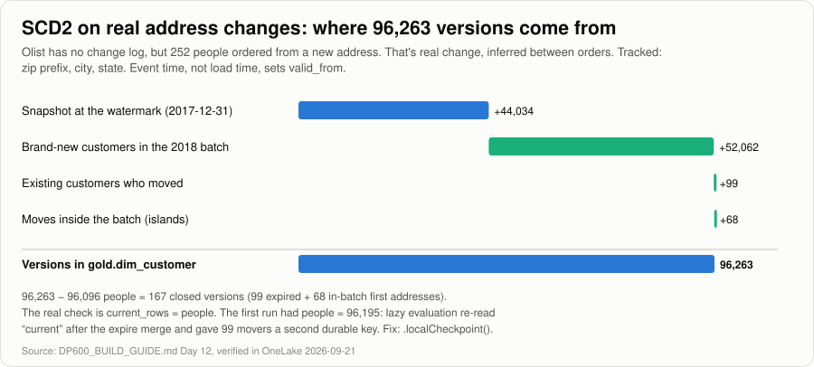

- `valid_from` uses **event time, not processing time** (the most common SCD2 bug); `valid_to` is `9999-12-31`, not null. History starts at the first load, so 92 pre-2018 moves collapse.
- **The point-in-time join is the line that makes SCD2 work.** An `is_current = 1` filter would have dropped 167 versions' sales.
- Evidence: [movers keep one durable key](screenshots/d12-scd2-movers-same-key.png), [the 96,195 bug](screenshots/d12-scd2-people-96195-bug.png).

### Warehouse, and the one-button rebuild

- **Warehouse gaps, measured:** constraints need `NOT ENFORCED` (a duplicate insert then succeeds); CTAS makes columns nullable (Msg 8111); no `NVARCHAR`, no triggers; **`MERGE` works** (the note I started from was out of date). Views, functions and a stored procedure are in [`sql/`](sql/).
- **`P2 Rebuild`: bronze → silver → SCD2 → gold in ~7½ minutes, key sums identical before and after** (orders 4,944,305,961) ([screenshot](screenshots/d13-p2-rebuild-four-green.png)).

### Delta maintenance

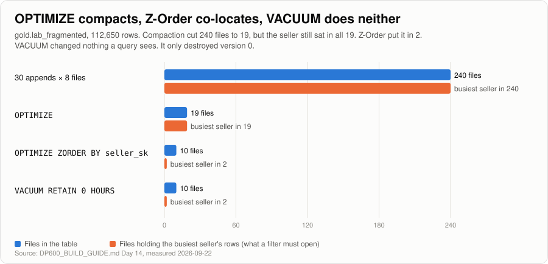

- Evidence: [`COUNT(*)` after VACUUM](screenshots/d14-count-after-vacuum-3713.png), [`SUM(price)` 404](screenshots/d14-sum-after-vacuum-404.png). Fabric auto-wrote `AUTOSET VORDER` on OPTIMIZE.
- A conditional OPTIMIZE pipeline (> 20 files) ran both branches ([true](screenshots/d14-maintenance-true-branch.png), [false](screenshots/d14-maintenance-false-branch.png)).
- A closed Spark SQL query tab kept a hidden LivySession holding the capacity ([screenshot](screenshots/d14-hidden-livysession.png)).

---

## Part 3: The semantic model, Domain 3 (Days 15–21)

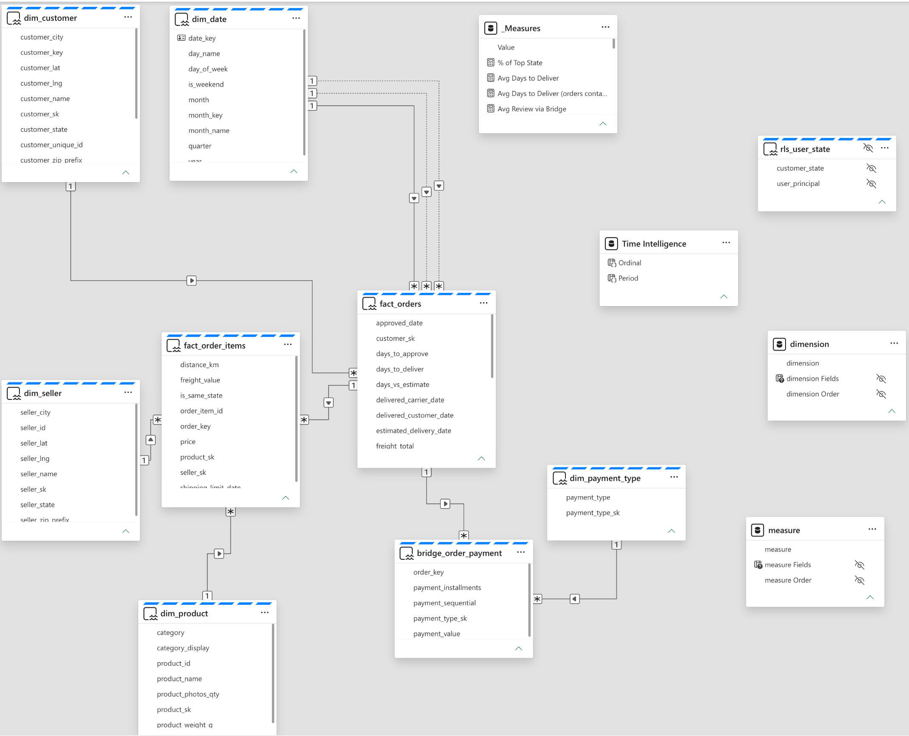

`Olist Model` is Direct Lake on OneLake over gold: header → lines, a payments bridge, three date relationships (one active), a calculation group, field parameters and a hidden `rls_user_state` mapping table. Definitions: [`semantic-model/olist-model/`](semantic-model/olist-model/).

### Build, relationships, many-to-many

- **After any Git update, a Direct Lake model answers nothing until *Refresh now*** (a seconds-long reframe).
- **What came across to Test:** no schemas, SQL endpoint identity mode reset to delegated, warehouse "Same as source" with no members; notebooks and reports autobind ([Test fails, which is the pass](screenshots/d15-test-fails-is-the-pass.png)).
- **SCD2 customer count:** `DISTINCTCOUNT(customer_key)` needs the fact as a filter; without it every year shows 96,097, because filters don't climb.
- **Header → lines trade-off:** Avg Days to Deliver sat flat at 12.50 per category until `CROSSFILTER` went into the measure ([screenshot](screenshots/d15-orders-containing-crossfilter.png)).
- **Bridge vs forced `*:*`:** the virtual blank row appeared under the bridge and vanished under `*:*` (a limited relationship), where `RELATED` fails and rows sum to 101,686 against a total of 99,441 ([bridge](screenshots/d15-bridge-blank-row.png), [`*:*`](screenshots/d15-many-to-many-no-blank-row.png), [`RELATED`](screenshots/d15-related-fails-limited.png)).

### Calculation groups, field parameters, format strings

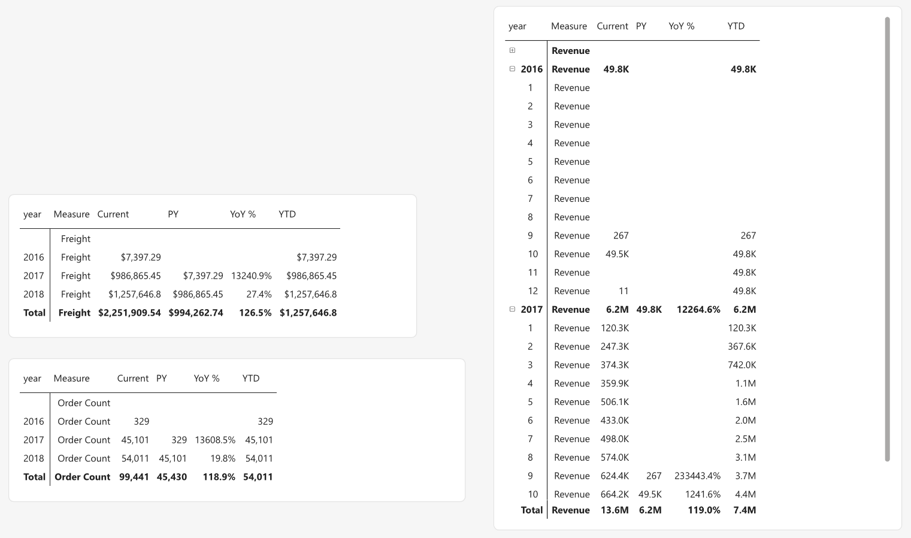

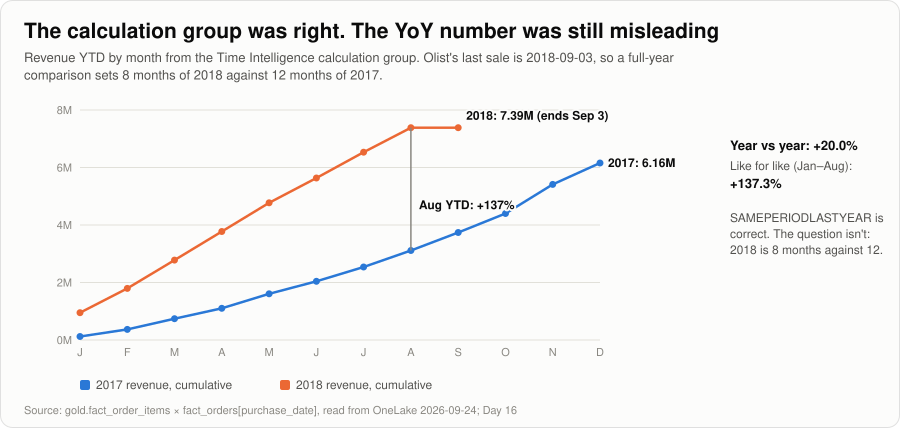

- **12 measures became 3 measures + 4 calculation items.** A group column with no measure raises `InvalidUnconstrainedJoin` ([screenshot](screenshots/d16-calc-group-unconstrained-join.png)); a calc item inherits the wrapped measure's format, so YoY first rendered as **$122.65** ([screenshot](screenshots/d16-yoy-formatted-as-currency.png)).
- **Dynamic format strings:** the scaling comma goes before the decimal (wrong twice); two levels in one matrix, measure-level K/M and item-level `0.0%` ([screenshot](screenshots/d17-dynamic-format-strings.png)).
- Field parameters: [blank](screenshots/d17-field-parameter-blank.png) → [the one setting](screenshots/d17-show-selected-field.png) → [working](screenshots/p2-report-field-parameters.png).

### DAX depth

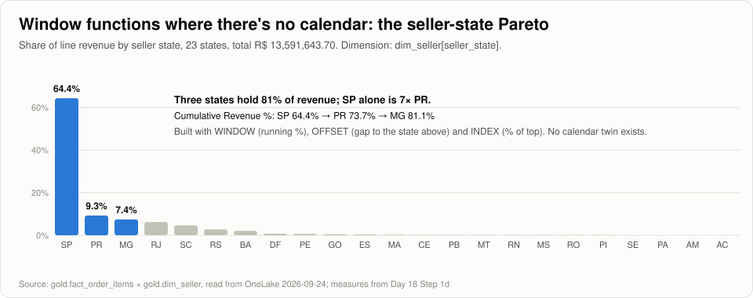

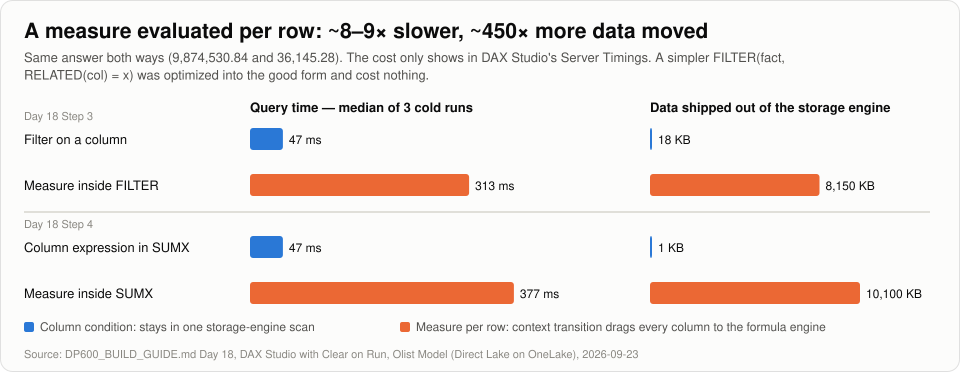

- **Window functions earn their place where there's no calendar:** three states hold 81% of revenue, and SP sells 7× what PR does ([screenshot](screenshots/p2-report-windowing.png)).
- **Window vs calendar twins agree per month and diverge at totals;** on `month_name` the window versions go silently wrong. "Previous month in view" (`OFFSET`) and "previous calendar month" (`PREVIOUSMONTH`) differ: 120,312.87 vs 120,301.97 ([screenshot](screenshots/d18-window-vs-calendar-twins.png)).
- **Information functions:** `HASONEVALUE` returned FALSE for six states that sell exactly one category, fixed by filtering through the fact ([screenshot](screenshots/d18-has-one-value-trap.png)).
- DAX Studio evidence for the filter finding: [optimized away](screenshots/d18-bad-filter-optimized-away.png), [measure in FILTER](screenshots/d18-bad-filter-measure.png), [column filter](screenshots/d18-good-filter-column.png), [slow iterate](screenshots/d18-slow-iterate.png), [fast iterate](screenshots/d18-fast-iterate.png).

| | |
|---|---|
| 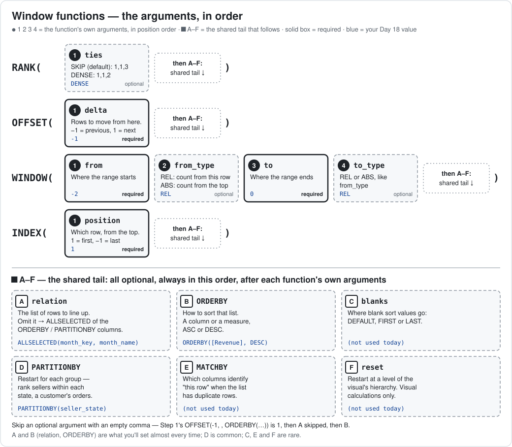 | 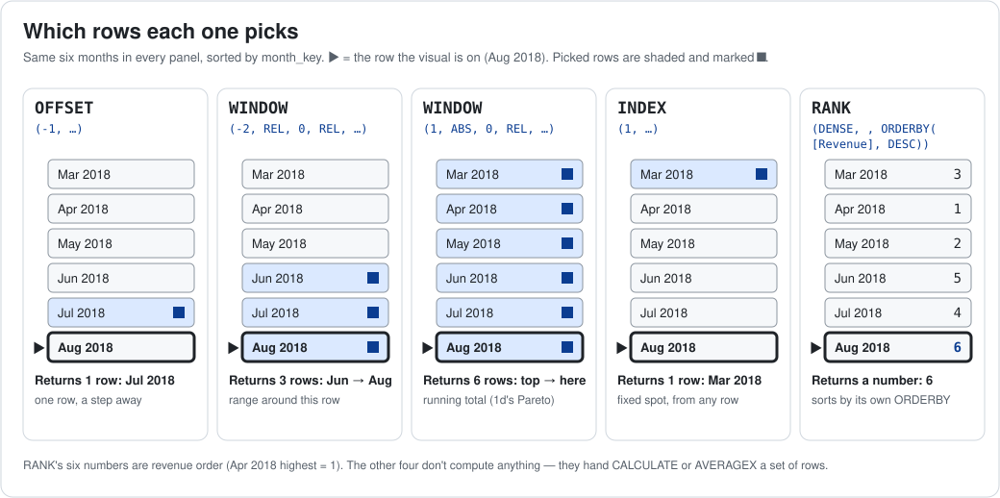 |
| 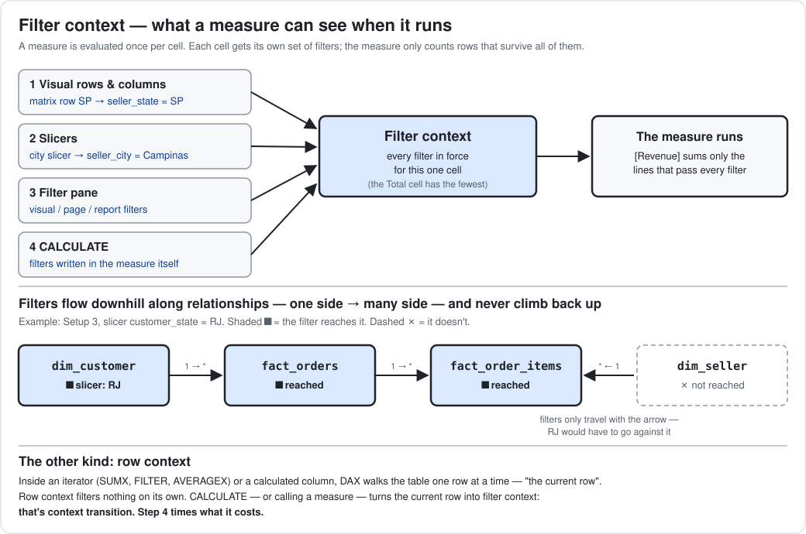 | 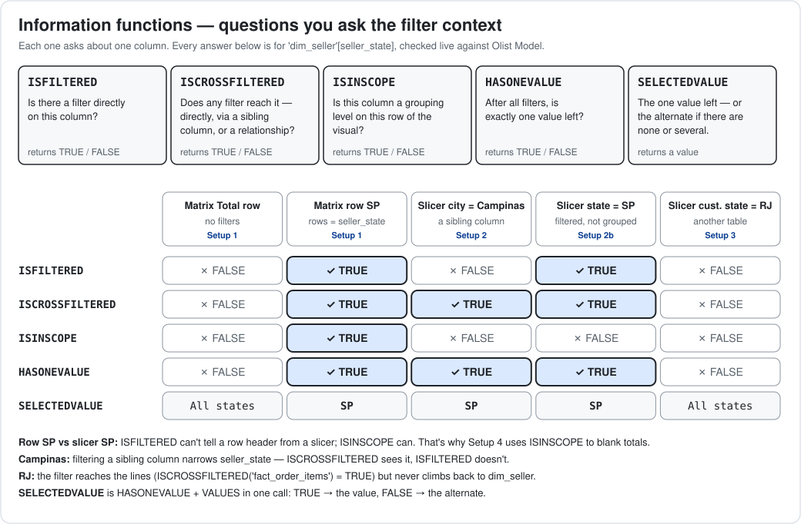 |

### RLS and OLS

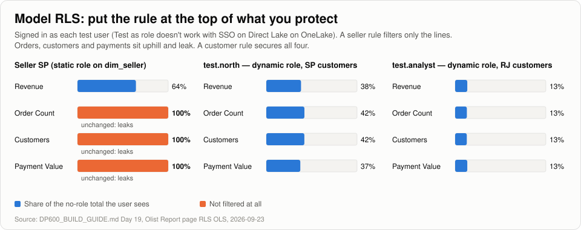

- **Test as role is blocked by SSO** on Direct Lake on OneLake ([screenshot](screenshots/d19-test-as-role-sso.png)), so RLS was verified by signing in as each user: [no role](screenshots/d19-rls-no-role.png), [test.north (SP)](screenshots/d19-rls-test-north-sp.png), [test.analyst (RJ)](screenshots/d19-rls-test-analyst-rj.png), [the static-role leak](screenshots/d19-static-seller-role-leak.png).
- Point-in-time RLS through SCD2: 26 people appear in two states.
- **The same user, two layers:** [SP only in the report](screenshots/d19-rls-test-north-sp.png), [every customer in the lakehouse](screenshots/d19-test-north-sees-all-customers.png).
- **OLS:** the first attempt landed on the table, not the column; a secured field [errors the visual like a deleted field](screenshots/d19-ols-visual-errors.png); **a role's own filter can still read a table that role hides with OLS**; and through a field parameter OLS [fails quietly](screenshots/d19-field-param-ols-quiet.png) instead.

### Incremental refresh and model size

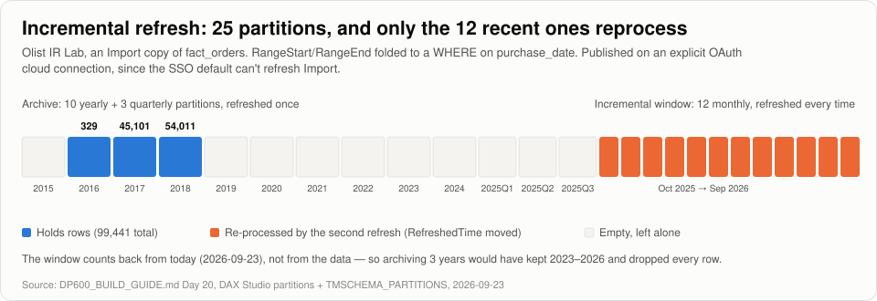

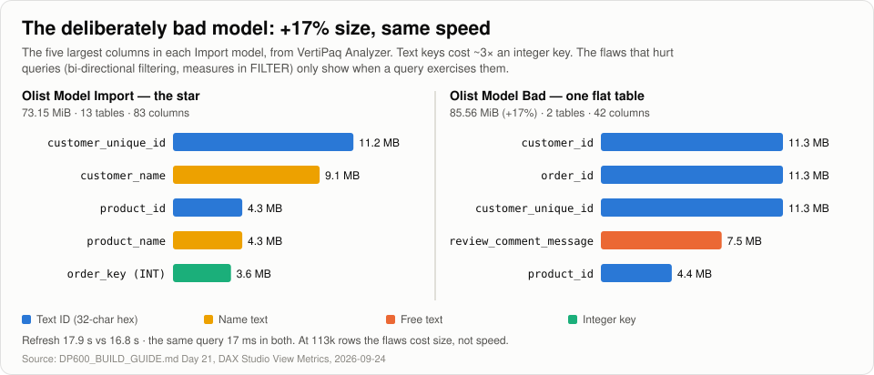

- **Incremental refresh's window counts back from today,** so reaching 2016 data needed an 11-year archive; `Date.From` folds; 25 partitions; the second refresh touched only the 12 monthly ones ([policy](screenshots/d20-incremental-refresh-policy.png), [refreshed times](screenshots/d20-partitions-refreshed-time.png)).
- An Import model on the *Default: Single Sign-On* connection can't refresh; it needs an explicit cloud connection ([screenshot](screenshots/d20-sso-default-connection.png)).
- **The bad model** ([`olist-model-bad`](semantic-model/olist-model-bad/)): a flat table with text keys, seconds-precision timestamps, a DAX date key, an iterating calculated column, bi-directional filtering and a measure inside `FILTER`. Flattening also duplicated lines: 113,314 rows (+664), and `SUM(price)` 13,651,923.47 against 13,591,643.70. Fix 1 went in, then the lab stopped: the other five fixes are ranked from the measured column sizes ([bad](screenshots/d21-bad-model-86mib.png), [good](screenshots/d21-import-model-73mib.png)).

---

## Part 4: Direct Lake, real-time, and the exam-only items (Days 22–25)

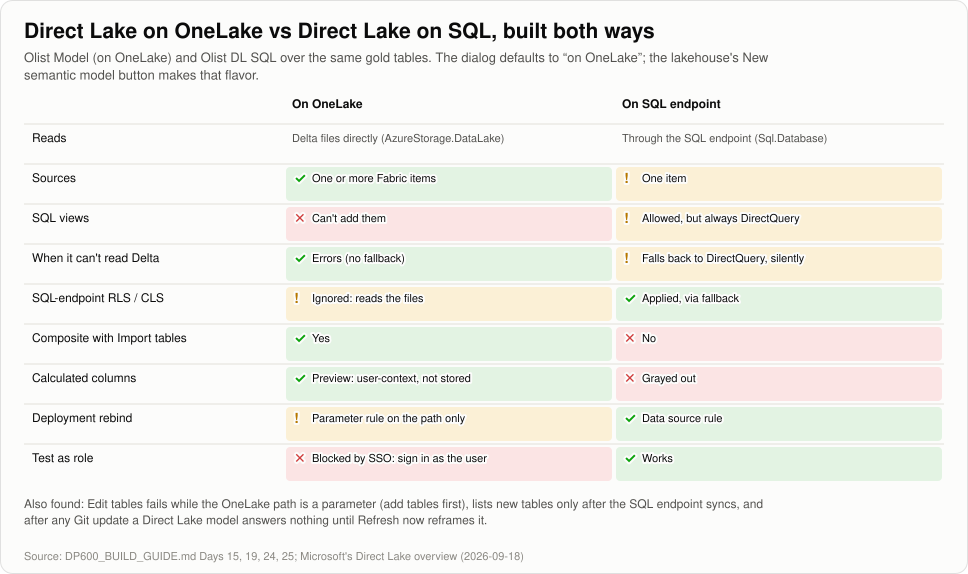

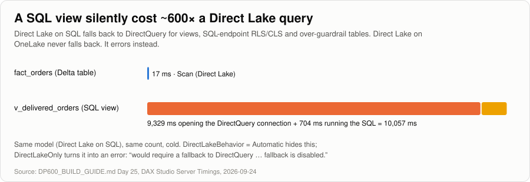

- **Direct Lake on OneLake vs on SQL, built both ways** ([`olist-dl-sql`](semantic-model/olist-dl-sql/)): the SQL flavor can't add a calculated column ([screenshot](screenshots/d24-dl-sql-new-column-grayed.png)) and is identified by a `Sql.Database` expression in TMDL ([screenshot](screenshots/d24-tmdl-sql-database.png)).
- **The fallback:** [17 ms scan](screenshots/d25-scan-17ms.png) vs [10,057 ms through the view](screenshots/d25-view-fallback-10057ms.png), and the SQL `LABEL` carries the model's DatasetId. [`DirectLakeOnly` makes it an error](screenshots/d25-direct-lake-only-error.png).
- **KQL:** every number matched the lakehouse; a weekly timechart shows Black Friday 2017 ([screenshot](screenshots/d22-kql-timechart-black-friday.png)). Queries in [`kql/`](kql/).
- **OneLake availability writes in batches of up to 3 hours,** per table: 63.6% complete while one table had a 5-minute policy ([screenshot](screenshots/d23-mirroring-statistics-63pct.png)).
- **`CREATE TABLE … LOCATION` in a Fabric lakehouse makes a OneLake shortcut** (Spark still reports MANAGED), and `DROP` removes only the shortcut ([notebook](notebooks/19-managed-vs-external-tables.py)).
- **The Purview hub is gone;** it's the OneLake catalog's Govern tab now. 77% of items were unlabeled, and every lakehouse carries a **DefaultReader** OneLake role ([Govern](screenshots/ex5-govern-tab.png), [coverage](screenshots/ex5-protect-77pct-unlabeled.png), [roles](screenshots/ex5-security-roles-defaultreader.png)).
- **The M drill found 8 orders marked delivered with no delivery date** ([screenshot](screenshots/ex9-m-delivery-bands.png)). Still open: the folding markers in Applied steps change at the `Typed` step, not at `Tried` as predicted, and that isn't settled.

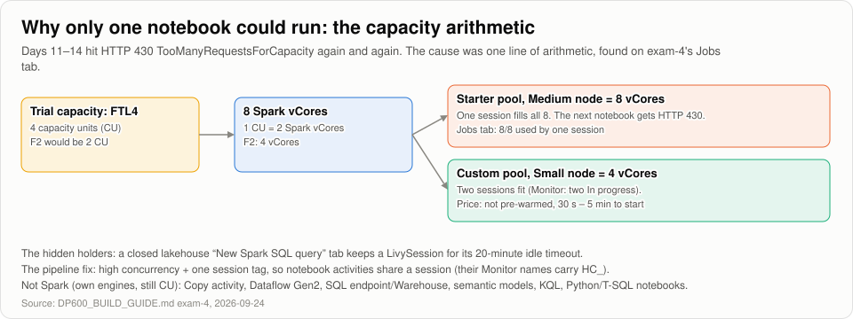

---

## Method

- **Row counts, not "Succeeded."** Every step had an expected number. That is what caught the backslash city, the 96,195 people, the `COUNT(*)` trap and the unused parameter.
- **Corrections go on the record.** The folding rule, the "bad filter" promise, field parameters, Direct Lake storage format, the geo design (median, one table), the header/detail relationship, `MERGE`, the Purview hub and the `COUNT(*)` explanation were all wrong somewhere in the build guide before a measurement fixed them.
- **Check a second source before blaming the platform.** The field-parameter "limitation" was two UI mistakes; the *Edit tables* failure was real. Only one of them deserved a workaround.
- **Stop a lab once the point is made.** Day 21 stopped after one measured fix and ranked the rest from evidence.

---

## Data honesty

- **Source and license.** [Brazilian E-Commerce Public Dataset by Olist](https://www.kaggle.com/datasets/olistbr/brazilian-ecommerce), published by Olist on Kaggle under [CC BY-NC-SA 4.0](https://creativecommons.org/licenses/by-nc-sa/4.0/). The gold samples in [`data-samples/`](data-samples/) are derived from it (typed, keyed, with synthetic names added) and are shared under the same license, non-commercially.
- **Names are synthetic.** Olist is anonymized and has no customer, seller or product names. Every name here was generated by [`scripts/generate_synthetic_names.py`](scripts/generate_synthetic_names.py), deterministically from the business keys, so the model is readable. None refers to a real person or business.
- **SCD2 is real change, but inferred.** 252 customers ordered from a new address; the move is only known to fall between two orders.
- **One delivery per order,** even for the 1,278 orders with items from several sellers, which a real marketplace would ship separately.
- **The purchase-date watermark can't see late status changes.** Olist has no last-modified column and no change data capture.
- **Identifiers are removed.** Test-user UPNs, the tenant domain, and workspace, lakehouse, endpoint and connection IDs are redacted in screenshots and replaced with placeholders like `<p2-olist-workspace-id>` in the code here. To run any of it, point it at your own items.

---

## What's here

| Folder | Contents |
|---|---|
| [`notebooks/`](notebooks/) | 19 PySpark / Spark SQL notebooks in Fabric's Git source format, numbered in build order |
| [`pipelines/`](pipelines/) | `P2 Incremental`, `P2 Fault Tolerance`, `P2 Rebuild`, `P2 Maintenance` (pipeline JSON) |
| [`dataflows/`](dataflows/) | `Profile Bronze` (the profiling and folding lab) and the M drill |
| [`semantic-model/`](semantic-model/) | TMDL for five models: Olist Model, its Import copy, the bad model, Direct Lake on SQL, the incremental-refresh lab |
| [`sql/`](sql/) | Warehouse tables, views, functions and procedure |
| [`kql/`](kql/) | Eventhouse schema and the KQL drill |
| [`data-samples/`](data-samples/) | 25 rows of each gold table, and the workspace's run history (79 runs) |
| [`graphics/`](graphics/) | The write-up's charts and diagrams, light and dark; regenerate with `make_graphics.py` |
| [`screenshots/`](screenshots/) | 113 screenshots, [cataloged by day](screenshots/README.md) |
| [`reference/`](reference/) | [Security in Fabric: ten layers](https://carlwooldridge.github.io/fabric-portfolio/P2-olist/reference/security-ten-layers.html) |

Everything else the workspace held, including every item's definition and the full commit history, is in [`CarlWooldridge/fabric-p2-olist`](https://github.com/CarlWooldridge/fabric-p2-olist).
